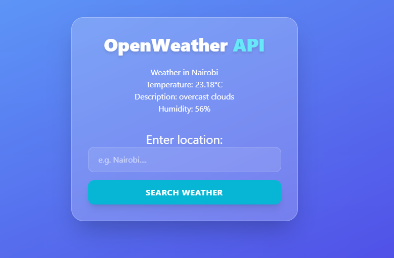

# OpenWeatherApp
A lightweight, responsive web application that allows users to check real-time weather conditions for any city worldwide using the OpenWeatherMap API.

## 🚀 Features
- Real-time Data: Fetches current temperature, humidity, and weather descriptions.

- Default Location: Automatically loads weather for Nairobi on startup.

- Dynamic Search: Users can search for any city via the input field.

- Error Handling: Alerts the user if a city is not found or if the API call fails.

- Asynchronous Logic: Uses async/await for smooth data fetching without page reloads.

## 🛠️ Technologies Used
- HTML5: Semantic structure.

- TailWind CSS: Styling and layout.

- JavaScript (ES6+): Fetch API, DOM manipulation, and Event Listeners.

- OpenWeatherMap API: Source of global weather data.

## 📋 Prerequisites
- To run this project locally, you will need an API key from OpenWeatherMap:

1. Go to OpenWeatherMap.

2. Sign up for a free account.

3. Generate an API Key (AppID).

## Installation and Setup
### 1. Clone the Repository:

```bash
git clone git@github.com:winstone-1/OpenWeatherApp.git
```
### 2. Navigate into Folder
```bash 
cd OpenWeatherApp
```
### 3. Add your API Key
```
const LocationAPIKey = "b665d211ec5a8d340c2dbde857512e70";

```
## Screenshot


## Support and Contact Information
**email:** winstonemuna404@gmail.com
**Phone number:** 0795278996

## License
### MIT License